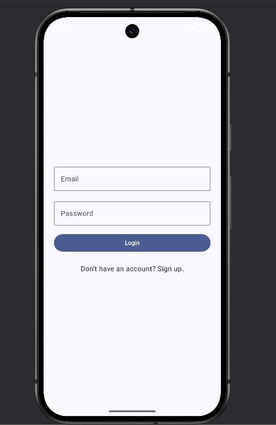
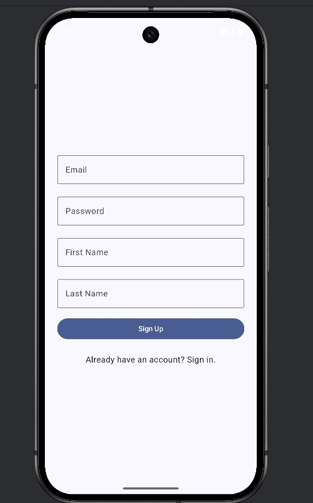
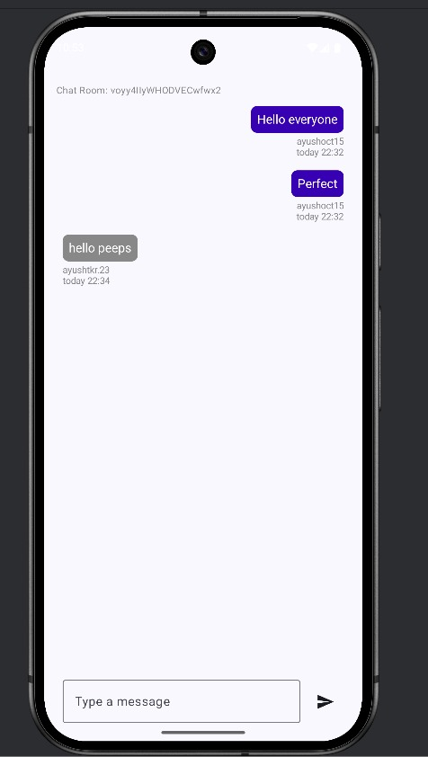

<div align="center">

# 💬 Real-Time Chat Room App

**Android · Kotlin · Jetpack Compose · Firebase**

[](https://kotlinlang.org/)
[](https://developer.android.com/compose)
[](https://firebase.google.com/)
[](https://developer.android.com/)
[](LICENSE)

</div>

---

## 📖 About

A fully functional **real-time group messaging app** for Android built with **Kotlin** and **Jetpack Compose**. Users can sign up, create or join named chat rooms, and exchange messages that sync instantly across all devices via **Firebase Firestore**. The UI follows modern Material Design principles with a clean dark-themed look, per-message timestamps, and smooth animations.

---

## ✨ Features

| Feature | Description |
|---|---|
| 🔐 **Secure Authentication** | Email/password sign-up and login via Firebase Auth |
| 🏠 **Dynamic Chat Rooms** | Create, browse, and join named public rooms |
| ⚡ **Real-Time Messaging** | Messages sync instantly using Firestore live listeners |
| 🕐 **Time Formatting** | Per-message timestamps formatted in a human-readable style |
| 🎨 **Modern Compose UI** | Fully declarative UI built with Jetpack Compose |
| 📱 **Clean Architecture** | MVVM pattern with clear separation of concerns |

---

## 🛠️ Tech Stack

| Layer | Technology |
|---|---|
| Language | Kotlin |
| UI Framework | Jetpack Compose |
| Architecture | MVVM |
| Authentication | Firebase Authentication |
| Database | Firebase Firestore |
| Build System | Gradle (Kotlin DSL) |
| Min SDK | 24 (Android 7.0) |
| Target SDK | 34 (Android 14) |

---

## 📂 Project Structure

```
Chat-Room-App/
├── app/
│   └── src/main/
│       ├── java/com/ayush/chatroomapp/
│       │   ├── data/
│       │   │   ├── model/          # Message, Room, User data classes
│       │   │   └── repository/     # Firestore & Auth repository implementations
│       │   ├── ui/
│       │   │   ├── screens/        # ChatScreen, RoomListScreen, LoginScreen, SignupScreen
│       │   │   ├── theme/          # Color, Typography, Theme
│       │   │   └── components/     # Reusable composables (MessageBubble, RoomCard, etc.)
│       │   ├── viewmodel/          # ChatViewModel, AuthViewModel, RoomViewModel
│       │   └── MainActivity.kt     # Entry point, NavHost setup
│       └── res/
│           └── values/             # strings.xml, themes.xml
├── google-services.json            # Firebase config (not committed — add your own)
├── build.gradle.kts
└── README.md
```

---

## 🚀 Getting Started

### Prerequisites

- Android Studio **Hedgehog** or later
- JDK 17+
- A Firebase project (free Spark plan is sufficient)

### 1 · Clone the repository

```bash
git clone https://github.com/thakur-027/Chat-Room-App.git
cd Chat-Room-App
```

### 2 · Set up Firebase

1. Go to [Firebase Console](https://console.firebase.google.com/) and create a new project
2. Add an **Android app** with package name `com.ayush.chatroomapp`
3. Download `google-services.json` and place it in the `/app` directory
4. Enable **Authentication** → Sign-in method → **Email/Password**
5. Enable **Firestore Database** → Start in **test mode** (for development)

### 3 · Firestore Data Structure

```
rooms/
  └── {roomId}/
        ├── name: String
        ├── createdAt: Timestamp
        └── messages/
              └── {messageId}/
                    ├── senderId: String
                    ├── senderName: String
                    ├── content: String
                    └── timestamp: Timestamp
```

### 4 · Build and Run

Open the project in **Android Studio**, let Gradle sync, then hit ▶ **Run** on a device or emulator (API 24+).

---

## 📸 Screenshots

<div align="center">

| Login | Sign Up | Chat Room |
|:---:|:---:|:---:|
|  |  |  |
| Email & password login with Firebase Auth | Full name + credentials sign-up flow | Real-time group messaging with per-user bubbles |

</div>

---

## 🗺️ Roadmap

- [ ] Push notifications via FCM
- [ ] Image sharing in chat
- [ ] Private / direct messaging
- [ ] User presence indicators (online/offline)
- [ ] Message read receipts

---

## 🤝 Contributing

Contributions, bug reports, and feature requests are welcome.

```bash
# Fork → create a branch → commit your changes → open a PR
git checkout -b feature/your-feature-name
git commit -m "feat: describe your change"
git push origin feature/your-feature-name
```

---

## 👤 Author

**Ayush Thakur**
B.E. ECE · SMVIT Bengaluru · Class of 2027

[](https://github.com/thakur-027)
[](https://www.linkedin.com/in/ayush-thakur015)
[](https://thakur-027.github.io)

---

## 📄 License

```
MIT License — feel free to use, modify, and distribute with attribution.
```

<div align="center">

Made with ❤️ using Kotlin & Jetpack Compose

</div>
